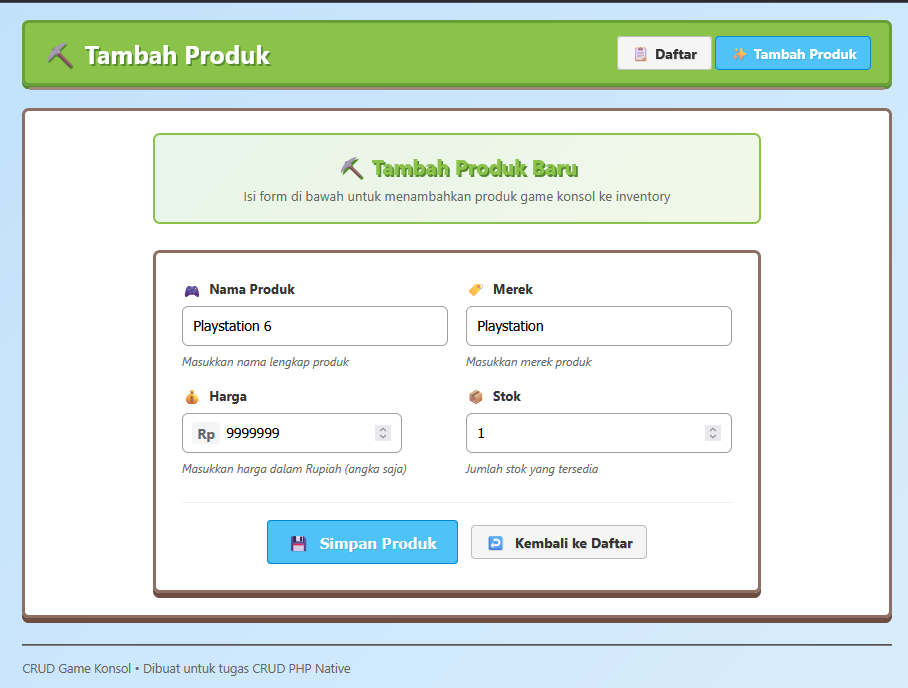
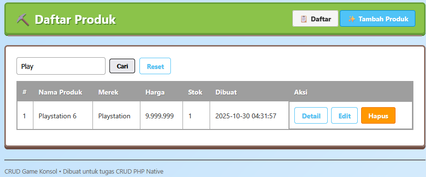

# 🧾 Judul Aplikasi
Aplikasi Web CRUD Game Konsol adalah sistem sederhana berbasis web yang digunakan untuk mengelola data game konsol.

Aplikasi ini memungkinkan pengguna untuk menambah, melihat, mengubah, dan menghapus data game dengan tampilan yang user-friendly.

Tujuan utama dari aplikasi ini adalah membantu pengguna mengelola koleksi game konsol secara praktis dan efisien.

---
 
## ✨ Fitur yang Tersedia
- Tambah data game (Create)
- Lihat daftar game (Read)
- Edit atau ubah data game (Update)
- Hapus data game (Delete)
- Pencarian data game berdasarkan nama atau kategori
- Validasi input sebelum disimpan ke database
- Tampilan dinamis menggunakan template header & footer
- Koneksi database dengan PDO (secure & fleksibel)
---

## ⚙️ Kebutuhan Sistem
- PHP versi 8.0 atau lebih baru
- Database MySQL / MariaDB
- Server lokal seperti XAMPP, Laragon, atau WAMP
- Browser modern (Chrome, Edge, Firefox)

---

## 🚀 Cara Instalasi dan Konfigurasi
Langkah-langkah umum untuk menjalankan aplikasi:

1. Clone atau download repository ini:
   git clone https://github.com/RxDnzMC/web-crud.git

2. Ekstrak ke direktori server lokal kamu:
   contoh: C:\laragon\www\web-crud

3. Import file database (.sql) ke phpMyAdmin atau MySQL.

4. Atur koneksi database di file konfigurasi (misal config.php atau .env).

5. Jalankan server lokal, lalu buka di browser:
   http://localhost/web-crud/

---

## 📂 Struktur Folder
Struktur umum direktori aplikasi:

web-crud/

├─ 📁 config/

│  └─ config.php

├─ 📁 gambar/

│  ├─ gambar2.png

│  ├─ gambar3.png

├─ 📁 includes/

│  ├─ header.php

│  ├─ footer.php

│  └─ functions.php

├─ 📄 create.php

├─ 📄 read.php

├─ 📄 update.php

├─ 📄 delete.php

├─ 📄 index.php

└─ 📄 db_gamekonsol.sql

---

## 🔧 Contoh Environment Config
Gunakan file .env atau file konfigurasi PHP sesuai kebutuhan kamu.


Contoh .env:
```
DB_HOST=localhost
DB_NAME=nama_database
DB_USER=root
DB_PASS=

Contoh config.php:
<?php
$host = 'localhost';
$dbname = 'nama_database';
$username = 'root';
$password = '';

try {
    $pdo = new PDO("mysql:host=$host;dbname=$dbname", $username, $password);
    $pdo->setAttribute(PDO::ATTR_ERRMODE, PDO::ERRMODE_EXCEPTION);    
} catch (PDOException $e) {
    die("Koneksi gagal: " . $e->getMessage());    
}
?>
```

---

## 📸 Screenshots

### Form Tambah Data


### Tabel Data



